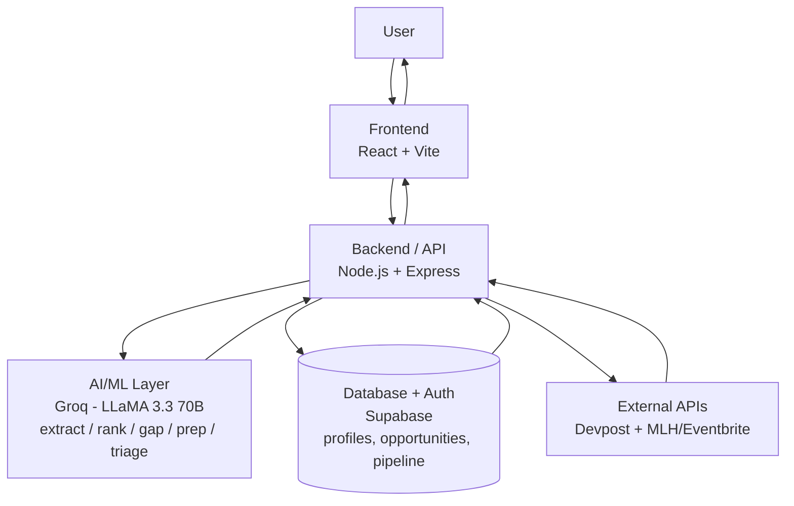

# System Architecture: AI Campus Opp

**Audience:** Solo hackathon developer, basic web dev knowledge, using an AI coding agent (Cursor)
**Constraint:** Must be buildable solo within hackathon time, but not throwaway — should extend cleanly into Future Scope
**Based on:** Final improved PRD (v2 + persistence, multi-source, and AI-visibility amendments)

---

## 1. Recommended Tech Stack

| Layer | Choice | Why |
|---|---|---|
| Frontend | **React + Vite** | Already built, already known. No reason to switch. |
| Backend | **Node.js + Express** | Already built, already known. Matches the frontend language (JS everywhere = less context-switching for a solo dev with an AI agent). |
| Database + Auth | **Supabase (Postgres + built-in Auth)** | Solves persistence AND real auth in one setup — no separate JWT/session code needed. Structured columns for queryable fields (userId, deadline, status), `jsonb` column for flexible AI-extracted data. Simple JS SDK, browser table editor for fast debugging. |
| AI | **Groq API (LLaMA 3.3 70B)** | Already integrated, already fast, already free-tier friendly. No reason to add a second provider for MVP. |
| Hosting | **Vercel (frontend) + Render (backend)** | Already deployed. Zero migration cost. |
| External data | **Devpost API (existing) + one new source (MLH or Eventbrite)** | Devpost proven working; adding a second live source is the single most credible fix for the "one source" judge concern. |

**Rejected alternatives and why:**
- **MongoDB Atlas** — solves persistence only; auth would still need to be hand-built later. Supabase gets both for similar effort.
- **Firebase** — also solves both, but different query model/SDK style than Postgres and less transferable SQL skill.
- **Redis, Kafka, microservices** — no genuine requirement here. Single Express server easily handles hackathon-scale traffic.

---

## 2. Frontend Architecture

Single-page React app (Vite), organized by feature rather than by file type, so the AI agent can work on one journey at a time without touching unrelated code.

- **Pages:** Home/Feed, Profile Setup (resume paste), Opportunity Detail, Pipeline (tracker), Triage view.
- **Components:** OpportunityCard (with match badges + raw/structured toggle), SkillGapBadge, UrgencyTag, PipelineBoard (simple 4-column Kanban), ProfileForm.
- **State:** React state + Context for the current user's profile and pipeline (no Redux needed — app is not complex enough to justify it).
- **API layer:** a single `api/client.js` wrapping fetch calls to the backend, attaching the anonymous user ID (see Section 5) to every request.

**Why not Next.js/SSR:** No SEO or server-rendering requirement for a hackathon demo tool; Vite's simplicity and existing familiarity win.

---

## 3. Backend Architecture

Keep the existing Express app, organized into clear layers so new features slot in without restructuring:

- **Routes** — thin, map HTTP endpoints to controllers.
- **Controllers** — handle request/response, call services.
- **Services** — the actual logic: `aiService.js` (Groq calls), `devpostService.js`, `mlhService.js` (new), `rankingService.js`, `pipelineService.js`.
- **Models** — Mongoose schemas (Section 4).
- **Middleware** — request validation, rate limiting, user-ID extraction.

This is a classic layered monolith — intentionally not microservices. One deployable Express app is the correct scale for this product today and for the foreseeable future scope.

---

## 4. Database Choice and Schema-Level Overview

**Choice:** Supabase (Postgres), accessed via `@supabase/supabase-js`.

**Tables (schema-level, not exhaustive):**

```
profiles
  id (uuid, from Supabase Auth)
  skills jsonb
  interests jsonb
  eligibility jsonb
  raw_resume_text text
  updated_at

opportunities
  id uuid
  source text  -- devpost | mlh | seed | user-submitted
  title text
  type text
  deadline date
  eligibility jsonb
  skills jsonb
  tags jsonb
  raw_text text
  fetched_at

pipeline
  id uuid
  user_id uuid (ref → profiles.id)
  opportunity_id uuid (ref → opportunities.id)
  status text  -- saved | preparing | applied | result
  updated_at
```

**Why this shape:** structured columns (deadline, status, user_id) stay queryable/filterable; `jsonb` columns absorb the variable-shape AI output without rigid migrations. Auth user id doubles as the profile key — no separate identity table needed.

---

## 5. Authentication Approach

**MVP: Supabase Auth (magic-link or email/password).**

- Supabase's built-in Auth issues a real user id and session — no hand-written JWT/bcrypt/session code.
- Frontend uses `supabase.auth.signInWithOtp()` (magic link) or basic email/password for the fastest working login.
- That user id is the foreign key for `profiles` and `pipeline` rows — real cross-device persistence, not a localStorage workaround.

**Why:** This was previously deferred as "too much effort for a demo." Supabase removes that cost, so real auth is now in-scope for MVP rather than Future.

---

## 6. External APIs / Services

| Service | Purpose | Status |
|---|---|---|
| Devpost public API | Live hackathon listings | Current |
| MLH or Eventbrite API | Second live source (hackathons or workshops/competitions) | New — Improved MVP |
| Groq API | All AI extraction/ranking/reasoning | Current |

No new external services beyond one additional data source — deliberately, per the "don't introduce unnecessary technologies" constraint.

---

## 7. AI/ML Integration

All AI calls flow through a single `aiService.js` module in the backend so prompt logic, JSON parsing, and error handling live in one place:

- `extractOpportunity(rawText)` — listing → structured object
- `extractProfile(resumeText)` — resume → structured profile (same underlying function/prompt pattern as above, reused)
- `rankOpportunities(profile, opportunities[])` — returns scored, ordered list with relevance reasons
- `analyzeSkillGap(profile, opportunity)` — matched vs. missing skills
- `generatePrep(profile, opportunity, gap)` — checklist conditioned on the actual gap
- `triageDeadlines(profile, opportunities[])` — reasoning across a cluster of urgent items

All AI calls enforce `response_format: json_object` and are wrapped in try/catch with a defensive parser — if parsing fails, the API returns a clear error rather than corrupting the frontend state.

---

## 8. Complete Request/Data Flow

**Example: Resume onboarding → ranked list with skill gap**

1. User pastes resume text in frontend.
2. Frontend calls `POST /api/profile/extract` with `{ userId, resumeText }`.
3. Backend → `aiService.extractProfile()` → Groq → structured profile JSON.
4. Backend saves profile to MongoDB (`profiles` collection), keyed by `userId`.
5. Frontend requests `GET /api/opportunities` → backend merges Devpost + MLH/Eventbrite live results + seed data + any user-submitted pasted opportunities from MongoDB.
6. Backend calls `rankingService.rankOpportunities(profile, opportunities)` → Groq → scored list with reasons.
7. For each opportunity, backend calls `analyzeSkillGap()` → attaches matched/missing skills.
8. Combined payload returned to frontend; UI renders cards with score, reason, and skill-gap badges.
9. User clicks "Prep" → `POST /api/prep` → gap-aware checklist generated and returned.
10. User clicks "Save" → `POST /api/pipeline` → status record written to MongoDB.

---

## 9. Folder Structure

```
ai-campus-opp/
├── client/                      # React + Vite frontend
│   ├── src/
│   │   ├── api/                 # client.js - fetch wrapper, attaches userId
│   │   ├── components/          # OpportunityCard, SkillGapBadge, PipelineBoard, etc.
│   │   ├── pages/                # Feed, Profile, Detail, Pipeline, Triage
│   │   ├── context/              # UserContext (profile + pipeline state)
│   │   └── App.jsx
│   └── vite.config.js
│
├── server/                      # Node + Express backend
│   ├── routes/                  # thin route definitions
│   ├── controllers/             # request/response handling
│   ├── services/
│   │   ├── aiService.js
│   │   ├── devpostService.js
│   │   ├── mlhService.js        # new source connector
│   │   ├── rankingService.js
│   │   └── pipelineService.js
│   ├── models/                  # Mongoose schemas: User, Profile, Opportunity, Pipeline
│   ├── middleware/               # rate limiting, userId extraction, validation
│   └── index.js
│
└── README.md
```

This mirrors the layered structure already implicit in the current build — new features are new files in existing folders, not a restructure.

---

## 10. Major System Components

1. **Frontend UI** — feed, profile onboarding, opportunity detail, pipeline board, triage view.
2. **API layer (Express)** — routes/controllers, the single entry point for all client requests.
3. **AI Service Layer** — all Groq interactions, centralized.
4. **External Source Connectors** — Devpost, MLH/Eventbrite, isolated per-service so adding a third source later means adding one file, not touching existing ones.
5. **Persistence Layer** — MongoDB Atlas via Mongoose, storing profiles, opportunities, and pipeline state.
6. **Ranking/Reasoning Engine** — logically distinct from raw AI calls; this is where profile + opportunity data gets combined before being sent to the AI service.

---

## 11. Security Considerations

- **API keys (Groq, MongoDB URI) live only in backend environment variables** — never sent to or accessible from the frontend.
- **CORS restricted** to the deployed Vercel domain only.
- **Rate limiting** on AI-calling endpoints (e.g. `express-rate-limit`) to prevent runaway API usage/cost from repeated calls.
- **Input size limits** on pasted text (resume/listing) to control token usage and prevent abuse.
- **Defensive JSON parsing** on all AI responses — never trust the model to always return valid JSON, even with `response_format` enforced.
- **No sensitive PII stored** — MVP has no passwords; optional email field is for demo convenience only and should be labeled as such if shown to judges.
- **MongoDB Atlas network access** restricted to Render's IP range (or 0.0.0.0/0 only if necessary for hackathon simplicity, with awareness this is a demo-only tradeoff).

---

## 12. Deployment Architecture

- **Frontend:** Vercel, auto-deploys from `client/` on push.
- **Backend:** Render, auto-deploys from `server/` on push, environment variables (Groq key, Mongo URI, allowed CORS origin) set in Render dashboard.
- **Database:** MongoDB Atlas free-tier cluster, managed separately, connected via connection string in Render env vars.
- **No CI/CD pipeline beyond platform auto-deploy** — appropriate for this scale; adding a custom pipeline would be unnecessary process overhead for a hackathon project.

---

## 13. What Should Be Implemented NOW vs. FUTURE

### CURRENT (build for this submission)
- Existing extraction, ranking, prep endpoints (unchanged, foundation).
- Resume-to-profile extraction endpoint (reuses existing AI pattern).
- MongoDB Atlas integration for profile + pipeline persistence.
- Anonymous UUID-based lightweight identity (no password auth).
- One additional live source connector (MLH or Eventbrite).
- Skill-gap analysis attached to ranked results.
- Gap-driven prep checklist generation.
- Deadline triage reasoning across a set of urgent opportunities.
- Application pipeline tracker (Saved/Preparing/Applied/Result).
- Frontend: raw-vs-structured display, visible match/gap badges, source labeling (live vs. seed vs. user-submitted).
- Basic security: rate limiting, input size limits, env-var key storage, CORS restriction.

### FUTURE EXTENSIONS (explicitly deferred)
- Notifications (email/push) — would require a scheduler (e.g. `node-cron`) and an email service (e.g. Resend/SendGrid); no current requirement.
- Learned personalization from user behavior (would require event logging and a feedback loop into the ranking prompt/model).
- Browser extension or "share to app" capture.
- Admin/poster-facing portal for clubs/career cells to submit opportunities.
- Additional live-source integrations beyond the second one added now.
- Caching layer (Redis) — only if/when traffic or AI-call volume genuinely requires it; not justified at current scale.

---

## Architecture Diagram


