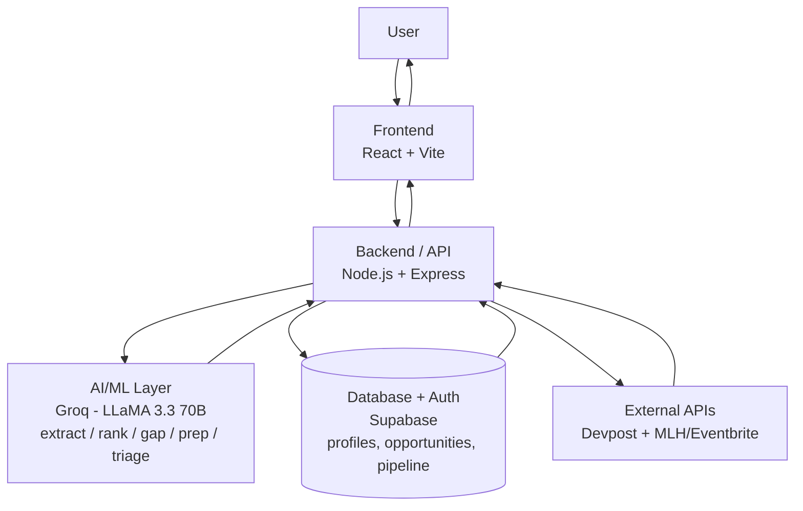

# AI Campus Opp

## 1. Project Title
**AI Campus Opp**

## 2. One-Line Description
An AI platform that turns a student's resume into a living profile, matches it against scattered campus opportunities with visible skill-gap reasoning, and helps them triage, prepare for, and track applications before deadlines pass.

## 3. Problem
Opportunity discovery for students is fragmented, overwhelming, and difficult to personalize. Students search across multiple platforms (WhatsApp, Instagram, LinkedIn, Unstop, Telegram, email, college portals) for hackathons, internships, competitions, scholarships, and workshops. Listings are unstructured, deadlines are easy to miss, and students struggle to judge which opportunities are worth their limited time — the deeper problem is not just finding opportunities, but making a confident decision, under time pressure, about which few are worth pursuing and what to do to be competitive.

## 4. Solution
AI Campus Opp structures unstructured listings using AI, ranks them against a student's own profile (auto-built from a pasted resume), surfaces *why* each opportunity is relevant and what skills are missing, highlights approaching deadlines, helps triage when multiple deadlines cluster, generates tailored prep guidance, and lets students track applications through a simple pipeline.

## 5. Key Features
- AI extraction of unstructured opportunity text into structured data (title, type, deadline, eligibility, skills, tags)
- Resume-to-profile extraction (same AI engine, reused)
- Live opportunity feed (Devpost, plus a second live source — MLH/Eventbrite)
- AI-powered ranking with relevance scoring and reasoning
- Skill-gap analysis per opportunity (matched vs. missing skills)
- Deadline urgency tagging (`urgent` / `soon` / `normal` / `closed`)
- Deadline triage across clustered urgent opportunities
- Gap-driven, personalized prep checklists
- Application pipeline tracker (Saved → Preparing → Applied → Result)
- Source transparency labeling (live vs. seed vs. user-submitted)

## 6. Demo
`[PLACEHOLDER: Live demo link]`
`[PLACEHOLDER: Demo video link]`

## 7. Screenshots
`[PLACEHOLDER: Screenshot — Opportunity Feed]`
`[PLACEHOLDER: Screenshot — Ranked List with Skill Gap]`
`[PLACEHOLDER: Screenshot — Prep Checklist]`
`[PLACEHOLDER: Screenshot — Pipeline Tracker]`

## 8. Tech Stack
| Layer | Technology |
|---|---|
| Frontend | React + Vite |
| Backend | Node.js + Express |
| Database + Auth | Supabase (Postgres, built-in Auth) |
| AI | Groq API (LLaMA 3.3 70B Versatile) |
| External data | Devpost API, `[PLACEHOLDER: MLH or Eventbrite API]` |
| Frontend hosting | Vercel |
| Backend hosting | Render |

## 9. Architecture Overview

Single-page React frontend calls a layered Express backend (routes → controllers → services). Services isolate AI calls (`aiService.js`), external source connectors (`devpostService.js`, `mlhService.js`), ranking logic, and pipeline logic. Supabase provides both persistence and authentication. Full detail in the Architecture document.

## 10. Project Structure
```
ai-campus-opp/
├── client/                      # React + Vite frontend
│   ├── src/
│   │   ├── api/                 # client.js - fetch wrapper
│   │   ├── components/          # OpportunityCard, SkillGapBadge, PipelineBoard, etc.
│   │   ├── pages/                # Feed, Profile, Detail, Pipeline, Triage
│   │   ├── context/              # UserContext
│   │   └── App.jsx
│   └── vite.config.js
│
├── server/                      # Node + Express backend
│   ├── routes/
│   ├── controllers/
│   ├── services/
│   │   ├── aiService.js
│   │   ├── devpostService.js
│   │   ├── mlhService.js
│   │   ├── rankingService.js
│   │   └── pipelineService.js
│   ├── models/
│   ├── middleware/
│   └── index.js
│
└── README.md
```

## 11. Prerequisites
- Node.js (LTS) and npm
- Git
- A Supabase account/project
- A Groq API key
- `[PLACEHOLDER: MLH/Eventbrite API key or credentials, if required by chosen source]`
- Windows/PowerShell users: `&&` is not a valid statement separator in PowerShell — use `;` or separate lines when chaining commands

## 12. Installation
```bash
git clone [PLACEHOLDER: repo URL]
cd ai-campus-opp

cd client
npm install

cd ../server
npm install
```

## 13. Environment Variables
Create a `.env` file in `server/`:
```
GROQ_API_KEY=[PLACEHOLDER]
SUPABASE_URL=[PLACEHOLDER]
SUPABASE_SERVICE_ROLE_KEY=[PLACEHOLDER]
CORS_ORIGIN=[PLACEHOLDER: deployed frontend URL]
PORT=3000
DEVPOST_API_BASE=[PLACEHOLDER]
MLH_API_KEY=[PLACEHOLDER]
```
Create a `.env` file in `client/`:
```
VITE_API_BASE=[PLACEHOLDER: backend URL, e.g. http://localhost:3000 for local dev]
VITE_SUPABASE_URL=[PLACEHOLDER]
VITE_SUPABASE_ANON_KEY=[PLACEHOLDER]
```
Never commit `.env` files. API keys must stay server-side only where applicable.

## 14. How to Run Frontend
```bash
cd client
npm run dev
```
Runs the Vite dev server (default `http://localhost:5173`).

## 15. How to Run Backend
```bash
cd server
npm run dev
```
`[PLACEHOLDER: confirm actual start script name, e.g. npm start or node index.js]`
Runs the Express server on the port set in `.env` (default `3000`).

## 16. Database Setup
1. Create a Supabase project.
2. In the Supabase SQL editor, run the schema defined in the Database Schema document (`profiles`, `opportunities`, `opportunity_matches`, `pipeline` tables, with their constraints and indexes).
3. Enable Row Level Security (RLS) policies so users can only read/write their own `profiles`, `opportunity_matches`, and `pipeline` rows. `[PLACEHOLDER: exact RLS policy SQL]`
4. Copy the project URL and keys into the environment variables above.

## 17. API Documentation
Full specification available in the API Specification document. Summary:

| Method | Endpoint | Purpose |
|---|---|---|
| POST | `/api/profile/extract` | Extract profile from resume text |
| GET | `/api/profile` | Get current user's profile |
| PUT | `/api/profile` | Update profile fields |
| POST | `/api/opportunities/extract` | Extract opportunity from pasted text |
| GET | `/api/opportunities` | List opportunities (filterable) |
| GET | `/api/opportunities/:id` | Get opportunity detail |
| GET | `/api/opportunities/ranked` | Ranked list with score + skill gap |
| GET | `/api/opportunities/:id/prep` | Generate gap-driven prep checklist |
| GET | `/api/opportunities/triage` | Deadline triage across urgent items |
| POST | `/api/pipeline` | Add opportunity to pipeline |
| GET | `/api/pipeline` | List pipeline |
| PATCH | `/api/pipeline/:id` | Update pipeline item |
| DELETE | `/api/pipeline/:id` | Remove pipeline item |

All authenticated endpoints require `Authorization: Bearer <Supabase JWT>`.

## 18. Testing
`[PLACEHOLDER: no automated test suite currently implemented]`
Manual API testing was performed using PowerShell's `Invoke-RestMethod` (`curl` is aliased to `Invoke-WebRequest` on Windows and is not suitable for this workflow).
```powershell
Invoke-RestMethod -Uri "http://localhost:3000/api/opportunities" -Method Get
```

## 19. Deployment
- **Frontend:** Deployed on Vercel, auto-deploys from `client/` on push. Live at `[PLACEHOLDER / existing: https://ai-campus-opp.vercel.app]`.
- **Backend:** Deployed on Render, auto-deploys from `server/` on push. Live at `[PLACEHOLDER / existing: https://ai-campus-opp.onrender.com]`. Note: Render free tier sleeps when idle; first request after inactivity may be slow.
- **Database:** Supabase-managed, no separate deployment step.
- Environment variables must be set in both Vercel and Render dashboards, matching Section 13.

## 20. Future Improvements
- Broader live-source aggregation (additional public APIs, community/club submission flow)
- Notifications (email/push) for approaching deadlines and triage alerts
- Learned personalization based on what a student saves, applies to, or skips over time
- Browser extension or "share to app" one-tap capture of listings
- Admin/poster-facing portal for clubs and career cells to submit opportunities directly
- Outcome tracking and light analytics

## 21. Team Members
`[PLACEHOLDER]` — Waheba (Solo Developer/Participant)
